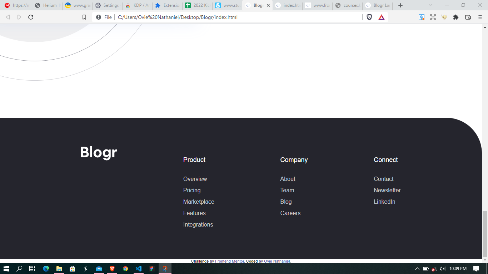

# Frontend Mentor - Blogr landing page solution

This is a solution to the [Blogr landing page challenge on Frontend Mentor](https://www.frontendmentor.io/challenges/blogr-landing-page-EX2RLAApP). Frontend Mentor challenges help you improve your coding skills by building realistic projects. 

## Table of contents

  - [Overview](#overview)
  - [The challenge](#the-challenge)
  - [Screenshot](#screenshot)
  - [Links](#links)
  - [My process](#my-process)
  - [Built with](#built-with)
  - [What I learned](#what-i-learned)
  - [Continued development](#continued-development)
  - [Useful resources](#useful-resources)
  - [Author](#author)
  - [Acknowledgments](#acknowledgments)


## Overview
A landing page website for a modern publishing platfrom called Blogr. This project tested my css layout skills and a little bit of my Javascript knowledge. 

### The challenge

Users should be able to:

- View the optimal layout for the site depending on their device's screen size
- See hover states for all interactive elements on the page

### Screenshot

1.DROP DOWN MENU AND NAVIGATION
 
This was the most challenging part of the challenge because it tested my css skills of how to position elements using the absolute and relative positions. The most challenging part of it was that I have to achieve the dropdown menu effect using Javascript by utilizing the event listeners of "Mouseover" and "Mouseleave".

2.HERO SECTION
 
This section was relatively easy to achieve, but the part that almost seemed overwhelming was position the background Image. I achieved the effect by setting the "url" of the image and a "linear gradient" to the backgroung-image property.

3.DESIGNED FOR THE FUTURE SECTION

This part wasn't difilcult, because I was able to utilize the power of css flexbox. I was able to achieve the effect of 
the images pushed to the coner by using "negative margins" and setting the body' horizontal overflow property to hidden.

4.STATE OF THE ART INFRASTRUCTURE SECTION
 
It took me more time to really get the solution of this section. I used relative and absolute positioning together with some negative margins to come up with the effect both for the mobile and desktop versions.

5.FREE, OPEN, SIMPLE SECTION

This was just a repition of the "designed for the future" section. The only deifference was that the position of the text and image was alternate.

6.FOOTER SECTION

I did this using css flexbox.


### Links

- Solution URL: [Add solution URL here](https://your-solution-url.com)
- Live Site URL: [Add live site URL here](https://your-live-site-url.com)

## My process
I used a desktop first aprroach in carrying out this project. I started out with structing my HTML code for the website and then I started adding my css styles for the desktop version first and them I used media queries to make it responsive 
and then added some special stylings for the mobile version. Javascript was added last for the functionality of the toggle menu.

### Built with

- Semantic HTML5 markup
- CSS custom properties
- Flexbox
- Desktop-first workflow
- Vanilla Javascript

### What I learned

- How to use Negative margins
- How to position elements using relative, absolute and static positin values
- How to combine linear gradients and images for the backgroung-image property
- How to postion background Images


```css
.proud-of-this-css {
  background-image: url("images/bg-pattern-intro-desktop.svg"), linear-gradient(135deg, hsl(13, 100%, 72%) 0%, hsl(353, 100%, 62%) 100%) ;;
}
```


### Continued development
I will continue focusing on how absolute and relative positioning works.


### Useful resources

- [Example resource 1](https://www.example.com) - This helped me to achieve the dropdown menu effect. I really liked this pattern and will use it going forward.
- [Example resource 2](https://www.example.com) - This is an amazing article which helped me finally understand XYZ. I'd recommend it to anyone still learning this concept.


## Author

- Website - [Ovie Nathaniel](https://github.com/ovie-best)
- Frontend Mentor - [@ovie-best](https://www.frontendmentor.io/profile/ovie-best)
- Twitter - [@oviebest_2](https://twitter.com/oviebest_2)


## Acknowledgments

Thanks to frontend mentor coding challenges, they really help me understand more of what I have learnt by putting them into actual practice and thanks to ----------------- for your explanations.
